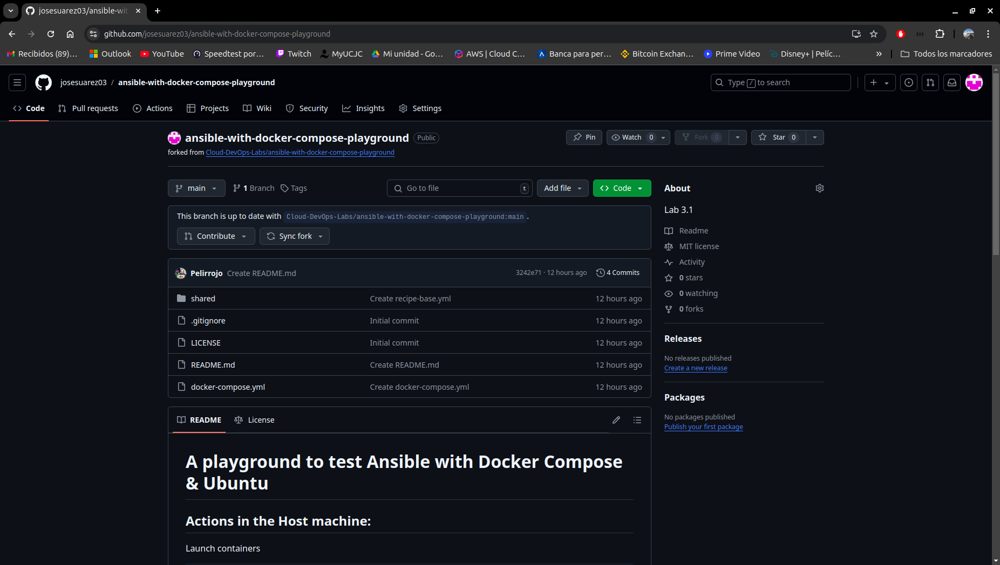
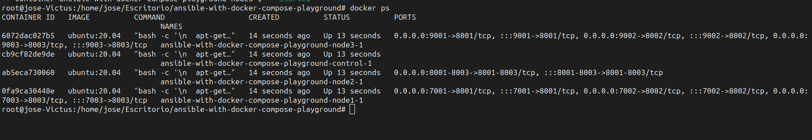
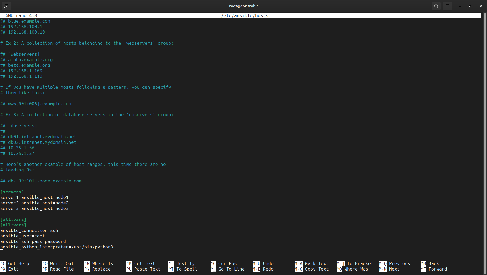
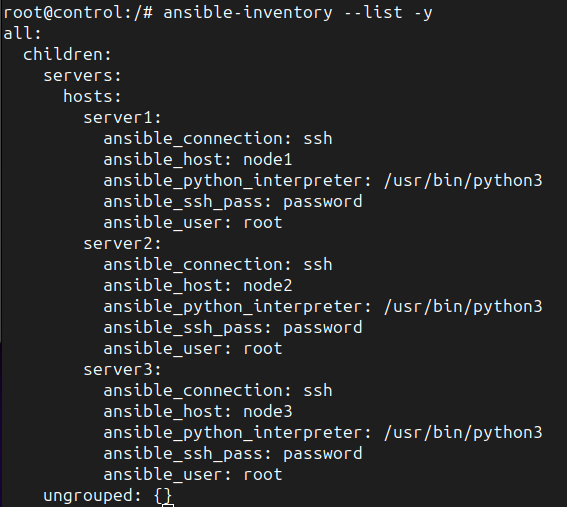
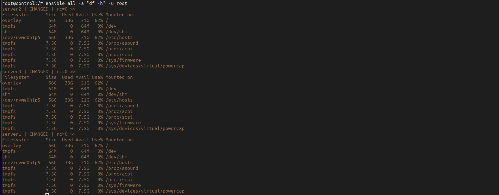
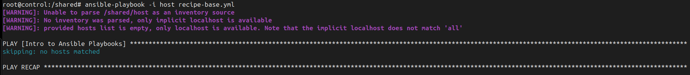

# A playground to test Ansible with Docker Compose & Ubuntu

## Actions in the Host machine:

Fork clone



Launch containers
```bash
docker-compose up -d
```



Jump to the control node from host machine
```bash
docker-compose exec control bash
```

Cleanup
```bash
docker compose down
```

# Inside control node

Install ansible
```bash
sudo apt update
sudo apt-get install nano
sudo apt-get install software-properties-common
sudo apt-add-repository ppa:ansible/ansible
```

Setup ansible
```bash
sudo nano /etc/ansible/hosts
```

Content of host the file:
```
[servers]
server1 ansible_host=node1
server2 ansible_host=node2
server3 ansible_host=node3

[all:vars]
[all:vars]
ansible_connection=ssh
ansible_user=root
ansible_ssh_pass=password
ansible_python_interpreter=/usr/bin/python3
```



Test conectivity
```bash
ansible-inventory --list -y
ansible all -m ping -u root
ansible all -a "df -h" -u root
```




Connect with nodes (ssh password is "password" without quotes):
```bash
ssh root@node1
ssh root@node2
ssh root@node3
```


Shared folder between host machine and control node:
```bash
cd /shared
```



And do the magic here!


